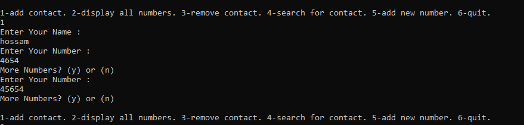
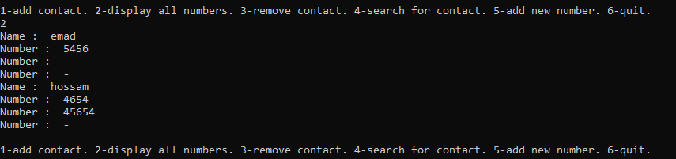
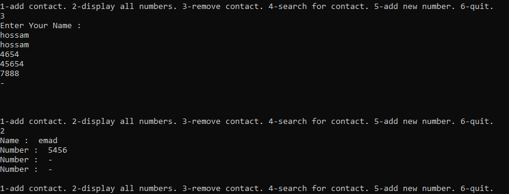
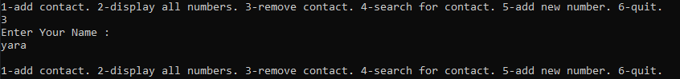
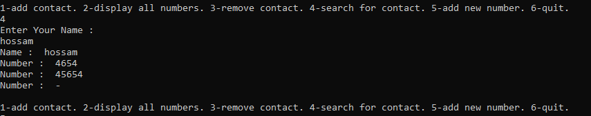
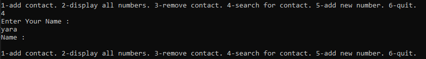
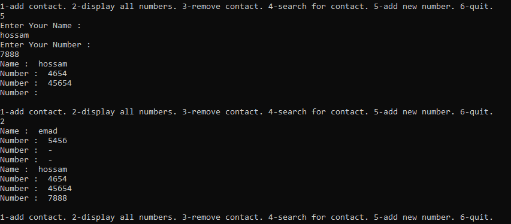
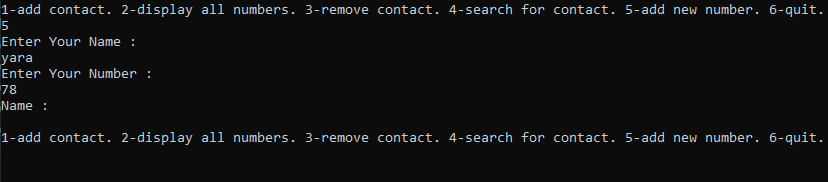
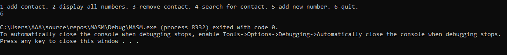

# PhoneBook
A phonebook app for intel8086,using assembly language ,a project for ECE311C course.
phonebook(directory) do Five operations:    
* add user
* display
* remove
* search
* add a number to an existing name
* quit
 
 
 ## Installation
 we use Irvine32: A library for assembly language, That is use to simplify tasks related to input-output and string handling in assembly language programming.
 ```
 include    c:\Irvine\Irvine32.inc
includelib c:\Irvine\irvine32.lib
includelib c:\Irvine\kernel32.lib
includelib y:\masm32\lib\user32.lib
```


## usage
First when you run the project we get the massage on screen to choose the number of operation you need to do  


   #### Add
   Allow to user to Enter its Name (the max contain 20 character )
   ```
    mov edx, arrayptr           ; Argument for ReadString: Pointer to memory
    mov ecx, 20                 ; Argument for ReadString: maximal number of chars
    call ReadString             ; Doesn't change EDX
    test eax, eax               ; EAX == 0 (got no string)
    jz zero_name                ; Yes: don't store a new arrayptr
    lea edx, [edx+eax+1]        ; EDX += EAX + 1
    mov arrayptr, edx           ; New pointer, points to the byte where the next string should begin
   ```    
  Then Allow to user to Enter its number,for each user three number to Enter (for each number max contain 15 character)
    ```
            cmp   maxNum , 3
            je    maxNumFunc
            lea   edx, mesToTakeNumber
	    call  writeString
	    call  CrLf
            mov edx, arrayptr           ; Argument for ReadString: Pointer to memory
            mov ecx, 15                 ; Argument for ReadString: maximal number of chars
            call ReadString             ; Doesn't change EDX
            inc     maxNum
            test eax, eax               ; EAX == 0 (got no string)
	    ```


 ###  2 - Display all Numbers.
 The user should enter `2` in order to choose the display option, as a result all his contacts will be displayed, after that the user will be prompted again for the next action to choose,also `-` sign means that there's a empty space that the user can add a number to that contact.
 


### 3 - Remove 
In order to delete a specific contact, the user should input 3 to choose the remove option, after that the user is prompted again to type the name he wants to delete, then the program will search the contacts for the target name

if the name exist, then it will be deleted from the contacts list: remove success


if the target name doesn't match any of the contacts, this will return NULL, in both cases, user is re-asked to select another option.



### 4 - Search
The search operation is designed to search by a name , the program searches all the contacts for that name , if name is found in the contacts , then that name and all related numbers will be displayed , if not found this will return `NULL`, in both cases, user is re-asked to select another option.. 
So, to perform search operation:
type number 4.
"Enter Name : " message is displayed the output will be either the required name with all related numbers



or ask for entering the name again (if the input name was a number or not existing name )



user is re-asked to select another option 

### 5 - Add  a number to an existing name
 Each name can have three numbers related to it . first user is asked to enter the name , then to enter the new number. If the name exists ,adding this number with the previous name is performed. Else user is re-asked to select another option.
So, that operation is done as following:
- enter number 5.
- "Enter Name" is displayed to prompt for name
- "Enter Number : " is displayed to prompt for number 



if not not existing name



- user is re-asked to select another option
### 6 - Quit
to close the program just enter number 6 in options prompt


